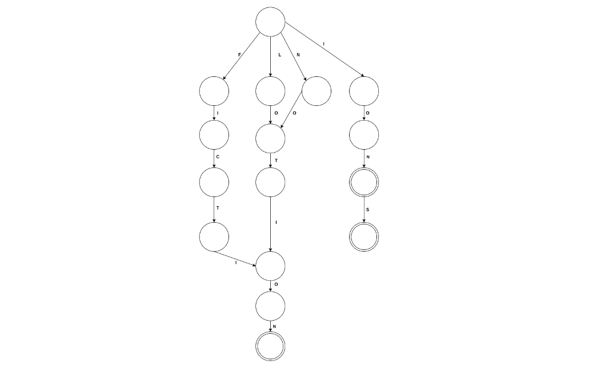
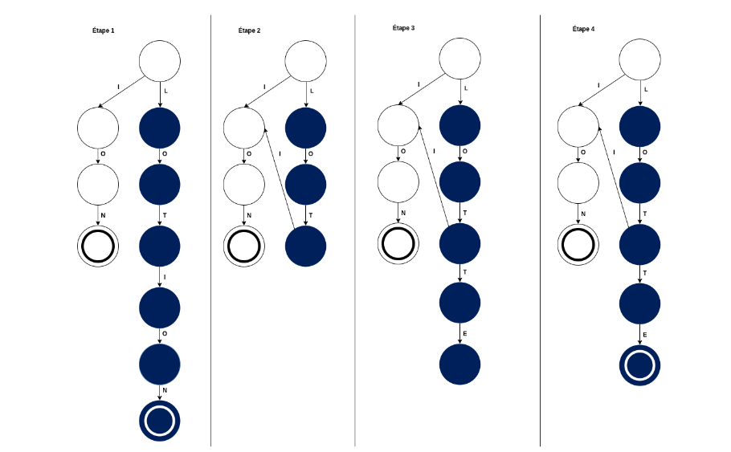

# Automatic language detection

## 1. Problem

In this project, the aim is to study a method of automatic detection of a language.
To simplify this study, only German, English and French will be considered.Accents and punctuation that can be found in French and German will not be used.


## 2. Proposed Approach
In order to solve the problem of automatic language detection, a dictionary matching approach will be used. The method is described below:

1. Analysis of the German, English and French dictionaries
2. Reading the text to be identified
3. For each word of the text to be identified test the correspondence of the word in relation to each of the dictionaries
4. Language of the text is the language with the highest number of positive matches

## 3. Data Structure
### 3.1 Trie (pefix tree)
A __Trie__, sometimes called a __prefix tree__, is a tree-like data structure that allows the storage of strings. Often used for the implementation of an associative table, a slightly modified form of the sort will be used in order to store dictionaries as well as possible.

The structure used to designate a node in the tree is composed of the following elements:
- An array of pointers to its wires, size 26 (for letters from a to z). A box i of this array is a pointer to its child node if it is possible to continue a word with the clue letter i from the prefix encoded by the current node, or a NULL pointer otherwise
- An attribute to know if the word formed from the root to the current node is a dictionary word

__Pros:__
- Finds & search strings in O(L) where L is length of single words
- Facilate printing words in alphabet order

__Cons:__
- Require huge memory for storing the strings
- Trie lookup can be slower than hash table lookup
- Some keys, such as floating point numbers, can lead to long chains and prefixes that are not particularly meaningful

##### A sort representing the words PI, PIE, FOOT, PORT, PIG and BRIDGE. The nodes of the tree that are double circled are the words belonging to the dictionaries


__Operations:__
- Insert inserts a string (the key) and a value into the trie
- Find returns the value for a key string

__Unlike a binary search tree, no node in the tree stores the key associated with that node; instead, its position in the tree defines the key with which it is associated__


### 3.2 Directed Acyclic Word Graph
A Directed Acyclic Word Graph, DAWG, is an acyclic oriented graph that allows the storage of strings of characters. The applications of such a structure are also similar to Trie. The structure of the vertices and edges of the graph will be of recursive type, the representation by adjacency matrix not being adapted to the iterative construction of the DAWG.
Here are the attributes making up the structure :
- A unique id representing the label associated with the current vertex
- A table of 26 elements (for letters from a to z) being either unpointed to the next vertex or empty. **This table represents the edges coming out of the current vertex**
- An attribute to know if the word formed from the root to the current vertex is a dictionary word

In addition to the vertex structure, the following data structures will be used during the DAWG generation phase:
- A structure representing an edge containing three attributes: 
  1. The label of the edge
  2. A pointer to the left vertex
  3. A pointer to the right vertex
- A hashmap which is an associative array allowing a key/value association containing the saved vertices of the graph. 
  - To add a vertex in the hashmap, its key will have to include the following information:
    1. if it is a final vertex
    2. the edges coming out of the vertex (label + id of the right vertex of the edge)
- A stack containing the edges whose right vertex has not yet been saved

__Minor details: a peak is considered as recorded when it has been minimized__

##### A DAWG representing each of the words FICTION, LOTION, NOTION, ION and IONS. The double-circled vertices of the graph are the words belonging to the dictionaries


__Minimisation:__
Minimization is a step that consists in removing unnecessary intermediate nodes and thus reducing the number of nodes to the strict minimum while keeping the same functioning of our graph. We will use this step in order to keep a DAWG as compact as possible in memory. It is for this step that the hashmap will be useful, to make efficient searches in the graph.

__Pseudo-code to generate DAWG:__

__1. Insertion:__
- Step 1: Find the size n of the largest common prefix between the previously inserted word and the new word to be inserted
- Step 2: Minimize DAWG to depth n
- Step 3: Add the uncommon suffix to the graph from, either from the root if the stack is empty or from the right apex of the last stacked edge
___For each letter of the suffix added to the graph stack the corresponding edge___
- Step 4: Mark the last vertex added as final

__2. Minimisation of DAWG of depth p:__
```
AS long as the size of the stack is greater than p DO:
  Unstack the stack, the unstacked edge will be named 'a'
  Check if a vertex equivalent to the right vertex of edge 'a' is already present in the hashmap
  IF this is the case THEN:
    Link the left vertex of edge a to this vertex
  Otherwise:
    Save this vertex in the hashmap
  END WITHDRAWN 
AS long as
```

##### The different steps of inserting the word LOTTE in the DAWG containing the following words : ION, LOTION. The white vertices are the vertices already recorded in the graph and contained in the hashmap. The navy blue vertices are the vertices that are not saved in the graph and whose incoming edges are contained in the stack




