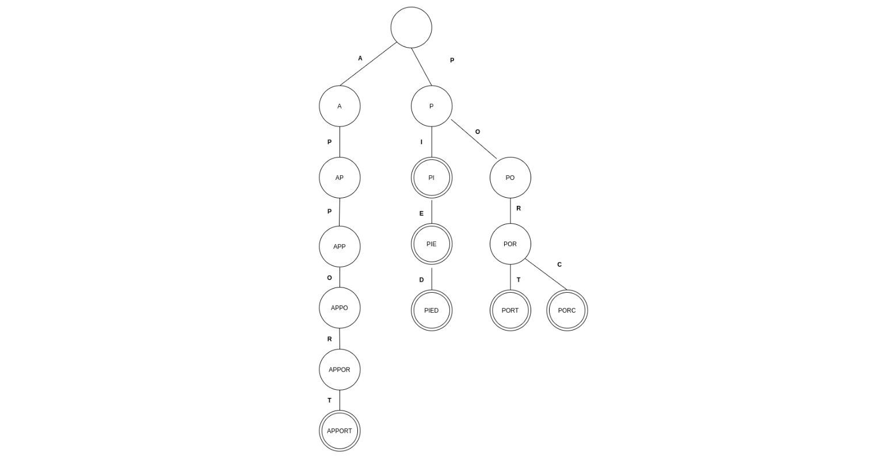

# Automatic language detection

## Introduction

### 1. Problem

In this project, the aim is to study a method of automatic detection of a language.
To simplify this study, only German, English and French will be considered.Accents and punctuation that can be found in French and German will not be used.

### 2. Proposed Approach
In order to solve the problem of automatic language detection, a dictionary matching approach will be used. The method is described below:

1. Analysis of the German, English and French dictionaries
2. Reading the text to be identified
3. For each word of the text to be identified test the correspondence of the word in relation to each of the dictionaries
4. Language of the text is the language with the highest number of positive matches

### 3. Data Structure
A sort, sometimes called a prefix tree, is a tree-like data structure that allows the storage of strings. Often used for the implementation of an associative table, a slightly modified form of the sort will be used in order to store dictionaries as well as possible.

The structure used to designate a node in the tree is composed of the following elements:
- An array of pointers to its wires, size 26 (for letters from a to z). A box i of this array is a pointer to its child node if it is possible to continue a word with the clue letter i from the prefix encoded by the current node, or a NULL pointer otherwise
- An attribute to know if the word formed from the root to the current node is a dictionary word

##### A sort representing the words PI, PIE, FOOT, PORT, PIG and BRIDGE. The nodes of the tree that are double circled are the words belonging to the dictionaries

